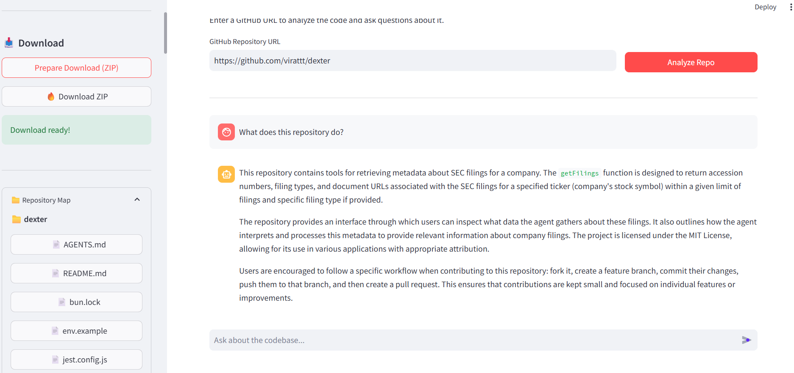

<<<<<<< HEAD
# GitAIReader – AI-Powered GitHub Code Assistant using Endee

## 📌 Project Overview
GitAIReader is an **AI-powered GitHub repository analysis tool** that enables users to ask **natural language questions about any public GitHub codebase**.  
The system uses **vector embeddings, hybrid search, and Retrieval Augmented Generation (RAG)** to understand source code and provide accurate, contextual answers.

At its core, the project uses **Endee as the vector database**, with a **robust local fallback mode** to ensure the application works even if the Endee server is unavailable.

---

## 🎯 Objectives
- Build a real-world **AI/ML project using vector search**
- Use **Endee** as the primary vector database
- Implement **Semantic Search + Hybrid Search + RAG**
- Analyze GitHub repositories programmatically
- Provide a clean, user-friendly interface using Streamlit
- Host the complete project on GitHub with proper documentation

---

## 🚀 Use Case Implemented
### ✅ AI-Powered Code Understanding (Semantic Search & RAG)

**What this application does:**
- Accepts a GitHub repository URL
- Clones the repository locally
- Splits code into meaningful chunks
- Generates vector embeddings
- Stores embeddings in **Endee**
- Retrieves relevant code using:
  - Vector similarity search
  - BM25 keyword search (hybrid search)
  - Cross-encoder reranking
- Uses a local LLM (via Ollama) to generate accurate answers

**Example questions:**
- "What does this repository do?"
- "Explain this file in simple terms"
- "Where is authentication handled?"
- "Why is this code used?"

---

## 🧠 Endee Vector Database Integration
Endee is used as the **core vector storage layer** for this project.

- Stores embeddings for all code chunks
- Enables fast vector similarity search
- Automatically switches to **local in-memory fallback mode** if:
  - Endee server is not running
  - Connection to `localhost:8080` fails
- Ensures reliability during local development

Official Endee repository:  
👉 https://github.com/EndeeLabs/endee

---

## 🛠️ Tech Stack
- **Language:** Python  
- **UI:** Streamlit  
- **Vector Database:** Endee (with local fallback)  
- **Embeddings:** Sentence Transformers (all-MiniLM-L6-v2)  
- **Search:** Vector Search + BM25 (Hybrid Search)  
- **Reranking:** Cross-Encoder (ms-marco-MiniLM)  
- **LLM Runtime:** Ollama (qwen2.5:3b recommended)  
- **Version Control:** Git & GitHub  

All dependencies are listed in `requirements.txt`.

---

## 🧩 System Architecture / Workflow
1. User enters a GitHub repository URL
2. Repository is cloned locally
3. Code files are scanned and filtered by extension
4. Files are split into overlapping chunks
5. Embeddings are generated
6. Embeddings are stored in Endee
7. User query is embedded
8. Hybrid search is performed:
   - Vector search (Endee)
   - Keyword search (BM25)
9. Results are reranked using a cross-encoder
10. Top results are passed to the LLM
11. Final response is streamed to the UI

---

## 📂 Project Structure
```
GitAicode_Reader/
├── app_files/
│   ├── app.py              # Streamlit frontend
│   └── README.md           # This file
├── backend.py              # RAG, hybrid search, Endee logic
├── endee_client.py         # Endee DB client with fallback
├── requirements.txt        # Python dependencies
├── start.bat               # Automated setup script
└── RUN_INSTRUCTIONS.md     # Detailed setup guide
=======
# Endee: High-Performance Open Source Vector Database

**Endee (nD)** is a specialized, high-performance vector database built for speed and efficiency. This guide covers supported platforms, dependency requirements, and detailed build instructions using both our automated installer and manual CMake configuration.

there are 3 ways to build and run endee:
1. quick installation and run using install.sh and run.sh scripts
2. manual build using cmake
3. using docker

also you can run endee using docker from docker hub without building it locally. refer to section 4 for more details.

---

## System Requirements

Before installing, ensure your system meets the following hardware and operating system requirements.

### Supported Operating Systems

* **Linux**: Ubuntu(22.04, 24.04, 25.04) Debian(12, 13), Rocky(8, 9, 10), Centos(8, 9, 10), Fedora(40, 42, 43)
* **macOS**: Apple Silicon (M Series) only.

### Required Dependencies

The following packages are required for compilation.

 `clang-19`, `cmake`, `build-essential`, `libssl-dev`, `libcurl4-openssl-dev`

> **Note:** The build system requires **Clang 19** (or a compatible recent Clang version) supporting C++20.

---

## 1. Quick Installation (Recommended)

The easiest way to build **ndd** is using the included `install.sh` script. This script handles OS detection, dependency checks, and configuration automatically.

### Usage

First, ensure the script is executable:
```bash
chmod +x ./install.sh
```

Run the script from the root of the repository. You **must** provide arguments for the build mode and/or CPU optimization.

```bash
./install.sh [BUILD_MODE] [CPU_OPTIMIZATION]
```

### Build Arguments

You can combine one **Build Mode** and one **CPU Optimization** flag.

#### Build Modes

| Flag | Description | CMake Equivalent |
| --- | --- | --- |
| `--release` | **Default.** Optimized release build. |  |
| `--debug_all` | Enables full debugging symbols. | `-DND_DEBUG=ON -DDEBUG=ON` |
| `--debug_nd` | Enables NDD-specific logging/timing. | `-DND_DEBUG=ON` |

#### CPU Optimization Options

Select the flag matching your hardware to enable SIMD optimizations.

| Flag | Description | Target Hardware |
| --- | --- | --- |
| `--avx2` | Enables AVX2 (FMA, F16C) | Modern x86_64 Intel/AMD |
| `--avx512` | Enables AVX512 (F, BW, VNNI, FP16) | Server-grade x86_64 (Xeon/Epyc) |
| `--neon` | Enables NEON (FP16, DotProd) | Apple Silicon / ARMv8.2+ |
| `--sve2` | Enables SVE2 (INT8/16, FP16) | ARMv9 / SVE2 compatible |

> **Note:** The `--avx512` build configuration enforces mandatory runtime checks for specific instruction sets. To successfully run this build, your CPU must support **`avx512` (Foundation), `avx512_fp16`, `avx512_vnni`, `avx512bw`, and `avx512_vpopcntdq`**; if any of these extensions are missing, the database will fail to initialize and exit immediately to avoid runtime crashes.


### Example Commands

**Build for Production (Intel/AMD with AVX2):**

```bash
./install.sh --release --avx2
```

**Example Build for Debugging (Apple Silicon):**

```bash
./install.sh --debug_all --neon
```

### Running the Server

We provide a `run.sh` script to simplify running the server. It automatically detects the built binary and uses `ndd_data_dir=./data` by default.

First, ensure the script is executable:

```bash
chmod +x ./run.sh
```

Then run the script:

```bash
./run.sh
```

This will automatically identify the latest binary and start the server.

#### Options

You can override the defaults using arguments:

*   `ndd_data_dir=DIR`: Set the data directory.
*   `binary_file=FILE`: Set the binary file to run.
*   `ndd_auth_token=TOKEN`: Set the authentication token (leave empty/ignore to run without authentication).

#### Examples

**Run with custom data directory:**

```bash
./run.sh ndd_data_dir=./my_data
```

**Run specific binary:**

```bash
./run.sh binary_file=./build/ndd-avx2
```

**Run with authentication token:**

```bash
./run.sh ndd_auth_token=your_token
```


**Run with all options**

```bash
./run.sh ndd_data_dir=./my_data binary_file=./build/ndd-avx2 ndd_auth_token=your_token
```

**For Help**

```bash
./run.sh --help
```


## 2. Manual Build (Advanced)

If you prefer to configure the build manually or integrate it into an existing install pipeline, you can use `cmake` directly.

### Step 1: Prepare Build Directory

```bash
mkdir build && cd build
```

### Step 2: Configure

Run `cmake` with the appropriate flags. You must manually define the compiler if it is not your system default.

**Configuration Flags:**

* **Debug Options:**
* `-DDEBUG=ON` (Enable debug symbols/O0)
* `-DND_DEBUG=ON` (Enable internal logging)


* **SIMD Selectors (Choose One):**
* `-DUSE_AVX2=ON`
* `-DUSE_AVX512=ON`
* `-DUSE_NEON=ON`
* `-DUSE_SVE2=ON`


**Example (x86_64 AVX512 Release):**

```bash
cmake -DCMAKE_BUILD_TYPE=Release \
      -DUSE_AVX512=ON \
      ..
```

### Step 3: Compile

```bash
make -j$(nproc)
```

### Running the Built Binary

After a successful build, the binary will be generated in the `build/` directory.

### Binary Naming

The output binary name depends on the SIMD flag used during compilation:

* `ndd-avx2`
* `ndd-avx512`
* `ndd-neon` (or `ndd-neon-darwin` for mac)
* `ndd-sve2`

A symlink called `ndd` links to the binary compiled for the current build.

### Runtime Environment Variables

Some environment variables **ndd** reads at runtime:

* `NDD_DATA_DIR`: Defines the data directory
* `NDD_AUTH_TOKEN`: Optional authentication token (see below)

### Authentication

**ndd** supports two authentication modes:

**Open Mode (No Authentication)** - Default when `NDD_AUTH_TOKEN` is not set:
```bash
# All APIs work without authentication
./build/ndd
curl http://{{BASE_URL}}/api/v1/index/list
```

**Token Mode** - When `NDD_AUTH_TOKEN` is set:
```bash
# Generate a secure token
export NDD_AUTH_TOKEN=$(openssl rand -hex 32)
./build/ndd

# All protected APIs require the token in Authorization header
curl -H "Authorization: $NDD_AUTH_TOKEN" http://{{BASE_URL}}/api/v1/index/list
```

### Execution Example

To run the database using the AVX2 binary and a local `data` folder:

```bash
# 1. Create the data directory
mkdir -p ./data

# 2. Export the environment variable and run
export NDD_DATA_DIR=$(pwd)/data
./build/ndd
```

Alternatively, as a single line:

```bash
NDD_DATA_DIR=./data ./build/ndd
>>>>>>> 3c275d9e81e63e9383d808ceef9bd44c61348d25
```

---

<<<<<<< HEAD
## ⚙️ Prerequisites

Before running the project, ensure you have:

1. **Python 3.10+** installed ([python.org](https://www.python.org/downloads/))
   - ⚠️ **CRITICAL**: Check "Add Python to PATH" during installation
2. **VS Code** installed ([code.visualstudio.com](https://code.visualstudio.com/))
3. **Git** installed ([git-scm.com](https://git-scm.com/downloads))
4. **Ollama** installed for AI capabilities ([ollama.com](https://ollama.com/))

### One-Time Ollama Setup
1. Open a terminal (Windows: Search "cmd" or "PowerShell")
2. Download the AI model:
   ```bash
   ollama run qwen2.5:3b
   ```
3. Wait for download, then type `/bye` to exit
4. Keep Ollama running in the background

---

## ▶️ Running the Project in VS Code

### 🔹 Step 1: Open Project in VS Code
1. Open VS Code
2. Click **File** → **Open Folder**
3. Navigate to and select the `GitAicode_Reader` folder

### 🔹 Step 2: Open Terminal in VS Code
Choose any method:
- **Keyboard Shortcut**: Press `Ctrl + `` (backtick)
- **Menu**: Click **Terminal** → **New Terminal**
- **Command Palette**: Press `Ctrl + Shift + P`, type "Create New Terminal", press Enter

### 🔹 Step 3: Run the Application

#### ✅ Option A: Automatic Setup (Recommended)
In the VS Code terminal, run:
```bash
.\start.bat
```

This script will automatically:
- ✓ Create a virtual environment
- ✓ Install all dependencies
- ✓ Check for Ollama
- ✓ Launch the Streamlit app

**Wait for the message:** `Local URL: http://localhost:8501`

#### 🔹 Option B: Manual Setup
If the automated script fails, run these commands one by one in the VS Code terminal:

```bash
# 1. Create virtual environment
python -m venv venv

# 2. Activate virtual environment
.\venv\Scripts\activate

# 3. Install dependencies
pip install -r requirements.txt

# 4. Run the application
streamlit run app_files/app.py
```

*Note: You should see `(venv)` at the start of your terminal prompt after activation*

### 🔹 Step 4: Open in Browser
Once you see `Local URL: http://localhost:8501`, open that URL in your web browser.

---

## 🖥️ How to Use the Application

1. **Enter GitHub URL**: Paste a repository URL (e.g., `https://github.com/pallets/flask`)
2. **Click "Analyze Repo"**: Wait for cloning and processing to complete
3. **Browse Files**: View repository files from the sidebar
4. **Ask Questions**: Type questions in natural language like:
   - "What does this repository do?"
   - "Explain this file in simple terms"
   - "Where is authentication handled?"
5. **View Results**: See AI-generated answers with referenced source files and metrics

---

## 📊 Example Output

**User Question:**
> "Explain what this file does"

**AI Response:**
- Human-readable explanation
- Technical function of the file
- Reason why the code exists
- Referenced source files

---

## 🖼️ Application Screenshots

### 1. Main Interface

*Clean, user-friendly interface with GitHub URL input, Ollama model selection, and speed tips for optimal performance*

### 2. Repository Analysis & AI-Powered Code Explanation

*AI-powered analysis showing detailed explanations of repository purpose, functionality, and workflow. Includes repository map, file browser, and download functionality*

### 3. File-Level AI Analysis

*Detailed file analysis with human-readable information and technical function breakdown for individual files*

---

## ⚠️ Troubleshooting in VS Code

### 🔴 "Connection refused" for localhost:8080
**This is normal and safe to ignore!**
- The app tries to connect to the Endee vector database server
- It automatically falls back to local in-memory storage
- Your application will work perfectly fine

### 🔴 "Ollama not found"
**Solution:**
1. Ensure Ollama is installed from [ollama.com](https://ollama.com/)
2. Verify it's running: `ollama list`
3. Download the model: `ollama run qwen2.5:3b`
4. Keep Ollama running in the background

### 🔴 "ModuleNotFoundError" or "streamlit is not recognized"
**Solution:**
1. Activate the virtual environment: `.\venv\Scripts\activate`
2. Look for `(venv)` at the start of your terminal prompt
3. Reinstall dependencies: `pip install -r requirements.txt`
4. Alternative: `python -m streamlit run app_files/app.py`

### 🔴 "Python is not recognized"
**Solution:**
1. Install Python from [python.org](https://www.python.org/downloads/)
2. Check **"Add Python to PATH"** during installation
3. Restart VS Code
4. Verify: `python --version`

### 🔴 Port 8501 already in use
**Solution:**
- Streamlit will use the next available port (8502, 8503, etc.)
- Check terminal output for the actual URL
- Or stop existing process: Press `Ctrl + C`

### 🔴 Slow AI responses
**Solution:**
- Use smaller models like `qwen2.5:3b` (recommended)
- Avoid large models like `llama2:70b`

### 🔴 Virtual environment activation issues
**Solution:**
- If `.\venv\Scripts\activate` doesn't work, try:
  - PowerShell: `.\venv\Scripts\Activate.ps1`
  - Command Prompt: `.\venv\Scripts\activate.bat`
- Or use the automated script: `.\start.bat`

---

## 🔄 Stopping the Application

To stop Streamlit in VS Code:
- Press `Ctrl + C` in the terminal
- Or close the terminal window
- Or click the trash icon in the terminal panel

---

## 🌱 Future Enhancements
- Web deployment
- Multi-repo comparison
- Agentic AI workflows
- Recommendation systems
- Docker support

---

## 📄 License
This project is licensed under the MIT License.

---

## 🙌 Acknowledgements
- **Endee Labs** – Vector Database
- **Ollama** – Local LLM runtime
- **LangChain** community
- Open-source AI ecosystem

---

## 👤 Author
**Mahesh**  
GitHub: https://github.com/Mahesh2004-prog
=======


## 3. Docker Deployment

We provide a Dockerfile for easy containerization. This ensures a consistent runtime environment and simplifies the deployment process across various platforms.

### Build the Image

You **must** specify the target architecture (`avx2`, `avx512`, `neon`, `sve2`) using the `BUILD_ARCH` build argument. You can optionally enable a debug build using the `DEBUG` argument.

```bash
# Production Build (AVX2) (for x86_64 systems)
docker build --ulimit nofile=100000:100000 --build-arg BUILD_ARCH=avx2 -t endee-oss:latest -f ./infra/Dockerfile .

# Debug Build (Neon) (for arm64, mac apple silicon)
docker build --ulimit nofile=100000:100000 --build-arg BUILD_ARCH=neon --build-arg DEBUG=true -t endee-oss:latest -f ./infra/Dockerfile .
```

### Run the Container

The container exposes port `8080` and stores data in `/data` inside container. You should persist this data using a docker volume.

```bash
docker run \
  -p 8080:8080 \
  -v endee-data:/data \
  -e NDD_AUTH_TOKEN="your_secure_token" \
  --name endee-server \
  endee-oss:latest
```

leave `NDD_AUTH_TOKEN` empty or remove it to run endee without authentication.

### Alternatively: Docker Compose

You can also use `docker-compose` to run the service.

1. Start the container:
   ```bash
   docker-compose up
   ```

---

## 4. Running Docker container from registry

You can run Endee directly using the pre-built image from Docker Hub without building locally.

### Using Docker Compose

Create a new directory for Endee:

```bash
mkdir endee && cd endee
```

Inside this directory, create a file named `docker-compose.yml` and copy the following content into it:

```yaml
services:
  endee:
    image: endeeio/endee-server:latest
    container_name: endee-server
    ports:
      - "8080:8080"
    environment:
      NDD_NUM_THREADS: 0
      NDD_AUTH_TOKEN: ""  # Optional: set for authentication
    volumes:
      - endee-data:/data
    restart: unless-stopped

volumes:
  endee-data:
```

Then run:
```bash
docker compose up -d
```

for more details visit [docs.endee.io](https://docs.endee.io/quick-start)

---

## Contribution

We welcome contributions from the community to help make vector search faster and more accessible for everyone. To contribute:

* **Submit Pull Requests**: Have a fix or a new feature? Fork the repo, create a branch, and send a PR.
* **Report Issues**: Found a bug or a performance bottleneck? Open an issue on GitHub with steps to reproduce it.
* **Suggest Improvements**: We are always looking to optimize performance; feel free to suggest new CPU target optimizations or architectural enhancements.
* **Feature Requests**: If there is a specific functionality you need, start a discussion in the issues section.

---

## License

Endee is open source software licensed under the
**Apache License 2.0**.

You are free to use, modify, and distribute this software for
personal, commercial, and production use.

See the LICENSE file for full license terms.

---

## Trademark and Branding

“Endee” and the Endee logo are trademarks of Endee Labs.

The Apache License 2.0 does **not** grant permission to use the Endee name,
logos, or branding in a way that suggests endorsement or affiliation.

If you offer a hosted or managed service based on this software, you must:
- Use your own branding
- Avoid implying it is an official Endee service

For trademark or branding permissions, contact: enterprise@endee.io

---

## Third-Party Software

This project includes or depends on third-party software components that are
licensed under their respective open source licenses.

Use of those components is governed by the terms and conditions of their
individual licenses, not by the Apache License 2.0 for this project.
>>>>>>> 3c275d9e81e63e9383d808ceef9bd44c61348d25
